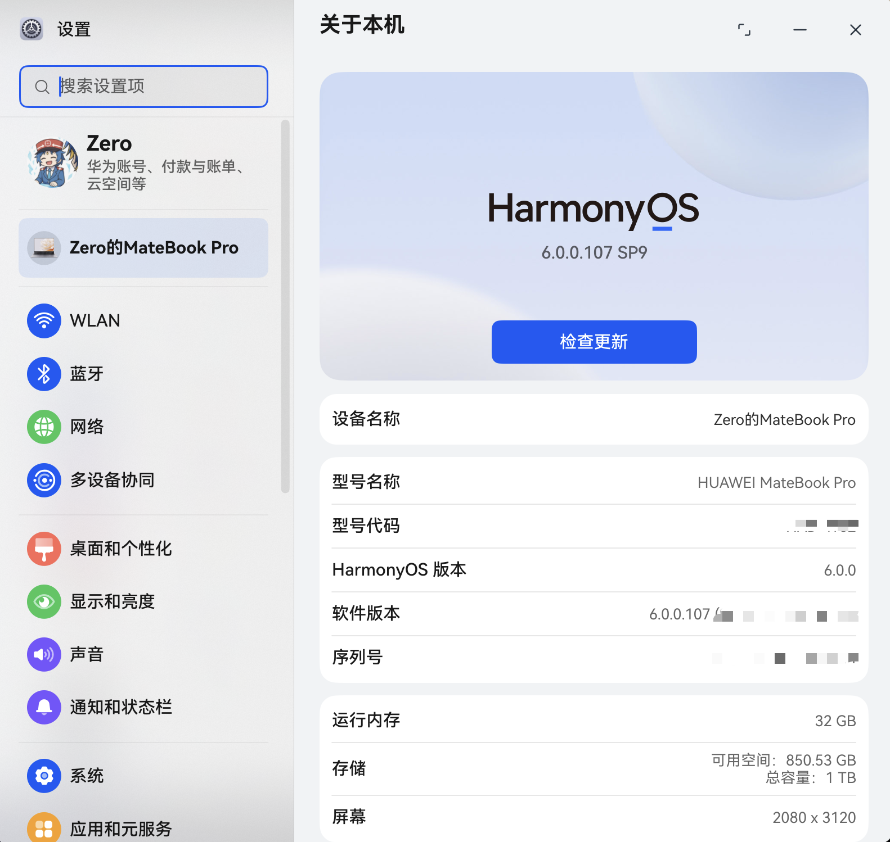
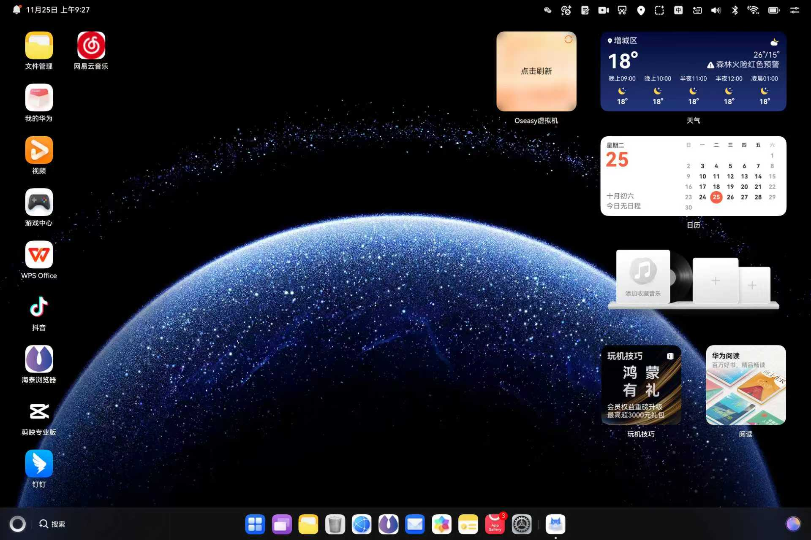
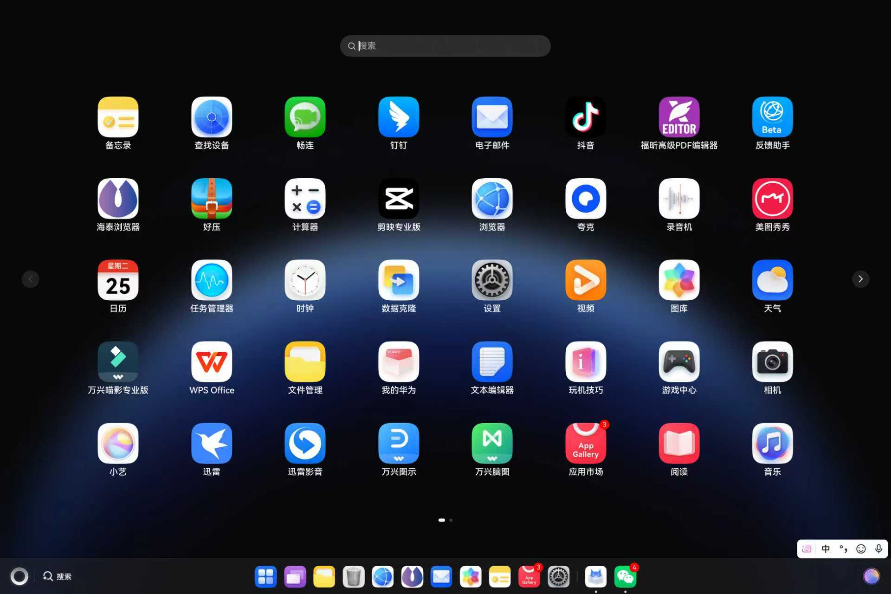
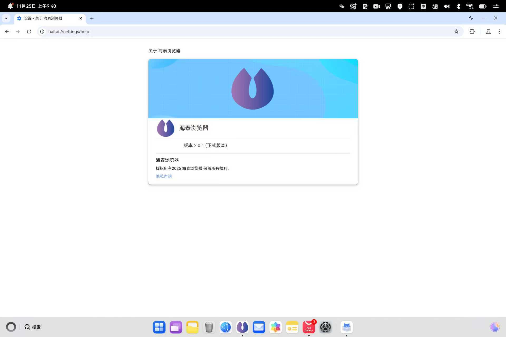
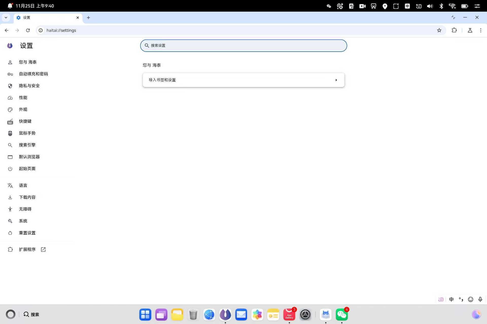
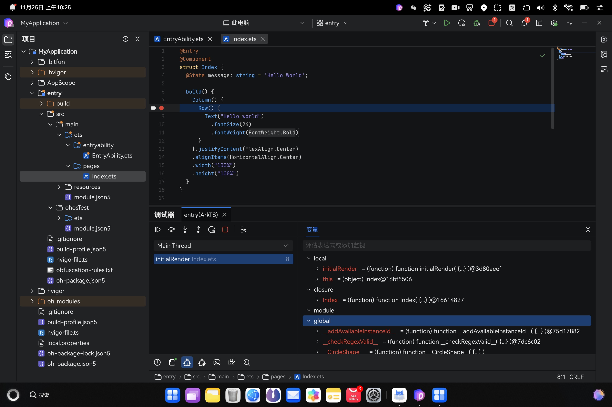

# 从前端视角看鸿蒙PC开发：遇到的问题与实践

鸿蒙PC发布至今已过去6个多月。就在这个月，我终于也是通过华为得到了一台鸿蒙PC 😋 

拿到的一瞬间真的很激动，它真的是太薄了，又薄又轻，比我现在用的 Macbook Air (M1) 还要薄要轻一半，属实是惊艳到我了。和我的 Macbook Air 一样也是无风扇的设计，目前不知道它的散热性能如何，但目前使用起来，发热量并不大，而且非常的安静。

拿到快递我迫不及待立刻开箱，开机，初始化配置之后，马上各个APP都看了几遍，整个系统特别的流畅丝滑，真的爽 😊 

鸿蒙PC的桌面，整体风格上像是 MacOS + Windows 的结合体，将类 Windows 的开始菜单放在了左下角，将类似 MacOS 启动台放在了中间，其中中间的头四个图标（启动台、多桌面、文件管理、回收站）是无法被移除的，而其他的图标则可以按照个人需要添加和移除。

看了一下应用市场，现在鸿蒙PC的生态还是比较封闭式的，和苹果一样，甚至在应用商店的审核机制上比苹果还要更加严格。电脑一拿到，内置安装了一堆APP，除去内置APP之外，还装了抖音、迅雷、万兴的几个软件等等。

应用市场的软件目前仍然还是以国产软件为主，并且大多数都是一些基础软件（微信、QQ、）看剧（如腾讯视频、爱奇艺）、刷视频（抖音、B站）和轻办公（WPS）这些面向 C 端的软件，看着大多很像都是从鸿蒙手机端直接适配过来的。

浏览器这一块，有华为自带的浏览器，也有一个 `海泰浏览器`, 这个实际上就是 `chromium` 只不过换了个名字。

## DevEco Studio Next

前段时间华为官网放出了那个传说中用 `Rust` 完全重写的 `DevEco Studio` 的内测申请，我当时知道消息马上就申请了，拿到 PC 的时候已经通过了审核，于是马上就去App Gallery 应用市场的 `应用尝鲜` 里找到了它：

安装好了之后直接打开，界面风格十分简洁，直接创建一个鸿蒙项目试试看：

然后发现了这个 DevEco Studio 第一个让我意外的地方：`它居然不支持触屏`！没错，除了三键（最大化、最小化、关闭）按钮区域的标题栏可以拖动之外，其他区域都不支持触屏操作。但是正常编译和运行鸿蒙项目到当前这台鸿蒙PC上是完全没有任何问题的：

但是此时又有一个很大的硬伤导致我抛弃了用它开发鸿蒙APP的念头：它的hilog日志面板无法显示当前APP的日志。。这太尴尬了，没有日志的话等于没法正常调试APP啊，虽然可以打断点啥的，但是没日志这.....开发个锤子 😂

> 导致我现在这两周以来，必须在我的 Macbook Air 上用老的 `DevEco Studio` 开发鸿蒙APP，然后用一条USB-C数据线和鸿蒙PC连接，然后开启`USB调试`模式，然后才能正常开发，属实是非常之麻烦了😭

虽然但是，调试协议这一块儿的功能是好的，可以正常打断点看上下文：

然后，开发体验吧...有时候还会遇到整个APP卡死的问题，就比如跳转到一个 OpenHarmony 内置的很大的 `.d.ts` 声明文件的时候，极其容易卡死，就是整个APP卡死、鼠标除了三键之外点不了窗口内的任何东西，而且三键之一的`关闭按钮`也关不了这个窗口，只能去设置里头强制关闭进程，23333 

😮‍💨 现在看来这个 `DevEco Studio Next` 仍然还是任重道远，它是基于毕方平台的，`.idea` 被改为了 `.bitfun`，emm...做出东西来的决心是有的，但是总感觉现在饼画太大开发者的实际体验还没跟上。而且，还有很多地方总感觉像是网页写的，UI特别像网页，不知道为啥 😂

另外，`git`、`node`、`npm`这些，在 `DevEco Studio Next` 的内置终端里是有自带在里面的：

> 可以看到，执行 `node -e "console.log(process.platform)"` 会返回 `openharmony`，这里埋个伏笔。

每个像 `git`、`node`、`npm` 这些工具都需要打包成 `.hnp` 格式的包（全称是 `HarmonyOS Native Package`），而且由于鸿蒙PC的沙箱机制，编译之后还必须放在 `hvigor` 工程的 `hnp` 目录下，`.hap` 应用本身不能直接动态通过API去动态管理和加载，只能编译好之后在工程中去添加，这实在是就很不人性化了。

目前已知的消息是，`.hnp` 应该就是未来鸿蒙PC的包格式，以后应该是会有一个系统级别的包管理器出现在鸿蒙PC上，社区现在已经有 `homebrew` 的鸿蒙PC Fork了（但是处于新建文件夹阶段，还是那四个字：任重道远，哈哈）。

## Electron 适配

这次拿到鸿蒙PC，我们想为它做一下 `vscode` 的鸿蒙PC适配。在此之前我们看了一下鸿蒙PC上已经有的一个 `vscode 的 fork`：`CodeArts`, 它基本上该有的功能都有了，但是唯独缺少一个很重要的就是 `vscode插件市场`。

我们纳闷了，为什么把插件市场给阉割了，搞了一会儿发现事情没那么简单，鸿蒙PC里面，`electron` 的 `.node` 依赖加载问题。

### `.node` 文件

可能有些人对 `.node` 文件不熟悉，这里简单解释一下，`.node` 文件相当于是 `Node.js` 中的动态链接库文件，又或是你可以称之为 `node.js addon` (Node.js 扩展)，你可以在 `C/C++/Rust` 中利用 node.js 的 `napi` 来编写 `node.js` 的扩展。

那么现在我们遇到的难题是什么呢？

### `.node` 编译问题

按照常规思维，我们需要把 `electron APP` 里面所有依赖了 `.node` 动态链接库的 npm 包都 `Fork` 出来，再编译为鸿蒙PC的 `arm64-unknown-linux-ohos` 架构就可以了，这样在鸿蒙PC上就可以正常加载了。

但是，鸿蒙的 `electron` 环境下不知道为什么，和普通的 `napi` 好像不太一样，编译出来还不行，运行之后会提示 `symbol not found` 即，找不到符号的错误。这个问题非常棘手，最后 还是 `@三川` 通过一个 `shim` 垫片仓库 [electron-ohos-napi-shim](https://github.com/ohosvscode/electron-ohos-napi-shim) 解决了 node.js 中的 `sqlite` 的 `.node` 加载的问题。

但是，这个 目前只是仅仅解决了 `sqlite` 的 `.node` 加载的问题，其他还有很多 `.node` 文件加载的问题他也没有解决。如果每个原生的 `.node` 都要去 `Fork` 出来修改，那这个工作量就太大了，而且也不现实。

我们现在希望，能不能让 `electron` 的 `.node` 能直接在鸿蒙PC上原生加载，而不是像现在这样需要通过修改源代码的方式来解决呢？

### `.node` 存放的位置和动态加载的问题

除去上面的一个问题，第二个问题是 `.node` 文件的存放位置问题。目前带有 `.node` 依赖的 `npm` 包是只能存放在工程目录的 `libs/arm64-v8a/node_modules` 下的：

这样加载，限制性很大，如果我需要动态从网络上下载 `.node` 文件然后加载，那该怎么办？无解了。

最简单的场景就比如vscode。vscode是基于JS/TS开发的，它拥有一个生态特别丰富的插件市场。其中，`vscode插件` 实际上就是一个压缩包，只不过它的扩展名被改为了 `.vsix`，安装 `vscode插件` 的原理就是把 `js代码` 和 `.node` 文件依赖动态从网络上下载下来，然后加载到鸿蒙PC上运行的，这样就可以实现 vscode 插件的动态更新和安装。如果是鸿蒙PC这种，如果遇到有 `.node` 文件的 vscode 插件，那该怎么办？

### 目前的成果

我们现在已经将 `YesPlayMusic` 这个网易云第三方客户端移植到了鸿蒙PC上，因为它是几乎没有带 `.node` 依赖的，纯 `JavaScript` 代码开发的项目现在已经可以正常移植到鸿蒙PC运行了，如下图：

但是仍然存在一个问题，不知道为什么我感觉这个 `YesPlayMusic` 帧率明显低于原生的鸿蒙APP，现在帧率目测的话，只有20-30帧左右，感觉滚动起来很卡顿。

### 关于 `process.platform`

`process` 是 node.js 中的一个全局对象，它代表当前的 `node.js` 进程，常常用于获取当前进程的环境信息，比如环境变量、平台信息都存放在 `process` 对象中；我们可以通过 `process.platform` 来获取当前进程的平台信息，它返回的是一个字符串，表示当前进程运行的平台，比如有以下的值：

- `linux` 代表 Linux 操作系统
- `darwin` 代表 macOS 操作系统
- `win32` 代表 Windows 操作系统
- 等等

鸿蒙PC在 `CodeArts` 的终端和 `DevEco Studio Next` 的内置终端里执行 `node -e "console.log(process.platform)"` 会返回 `openharmony`，而在我们的 `electron APP` 中打印 `process.platform` 会返回 `ohos`，为什么 `electron` 的 `process.platform` 的值和鸿蒙PC的不一样呢？到底哪个值是正确的呢？

2025年11月
Zero