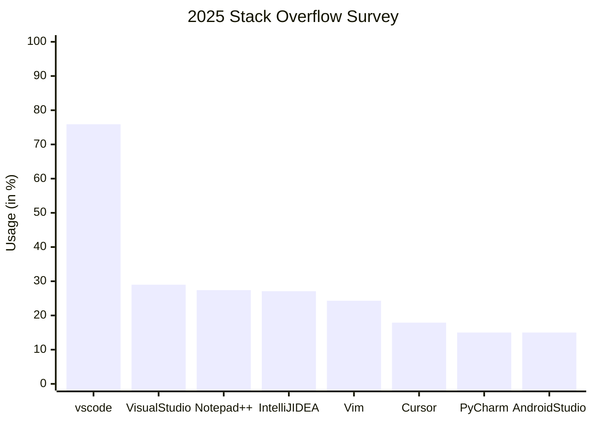

# Arkcode

  
  
  
  
  

---
layout: center
---

# Visual Studio Code

---

# 为何要首当其冲，做 `vscode` 的适配？

  

    

    
使用人数众多

  

```mermaid{class: 'max-w-50% mt-4 rounded-xl'}
xychart
    title "2025 Stack Overflow Survey"
    x-axis [vscode, Visual Studio, Notepad++, IntelliJ IDEA, Vim, Cursor, PyCharm, Android Studio]
    y-axis "Usage (in %)" 0 --> 100
    bar [75.9, 29, 27.4, 27.1, 24.3, 17.9, 15, 15]
```

---
layout: end
---

# Thank you.
