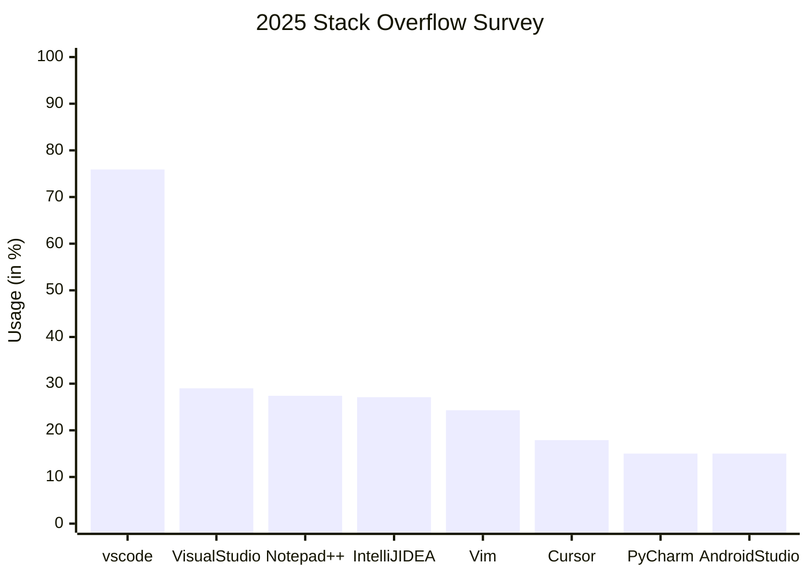

# Arkcode

  
  
  
  
  

---
layout: center
---

# Visual Studio Code

---

# 为何要首当其冲，做 `vscode` 的适配？

  

    

      

      
使用人数众多

    

  

  

    

      

        

        
AI 代码编辑器横行，类 vscode 编辑器繁多 

      

    

    

      

        

        
社区活跃，插件市场庞大

      

      

        

        

        

        

        

        

        

        

        

        

        
      

    

  

---
layout: end
---

# Thank you.
