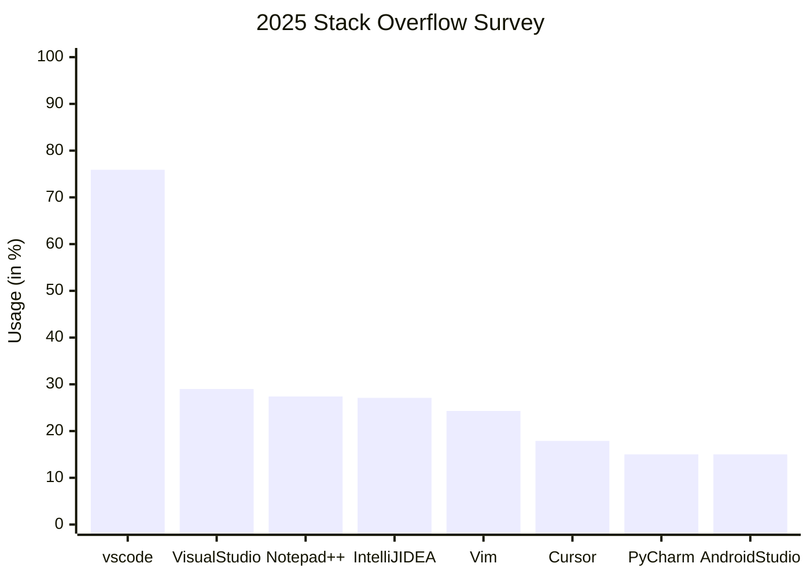
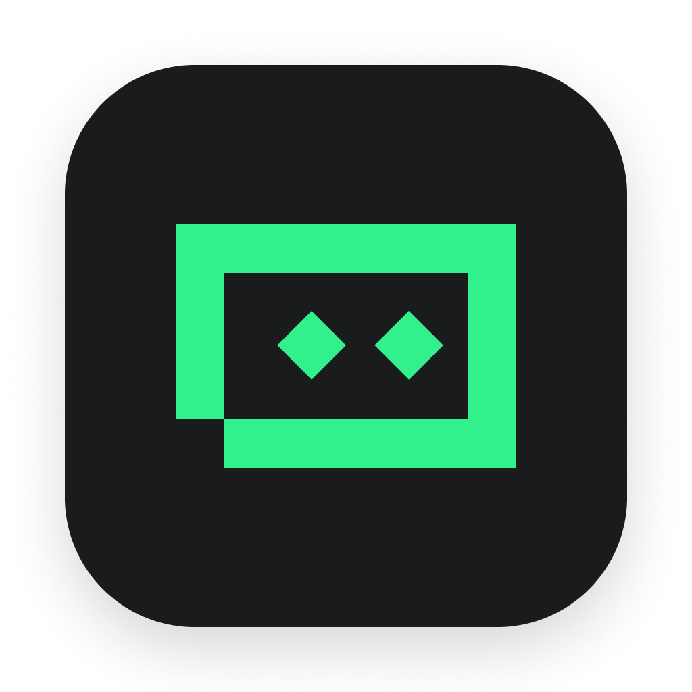
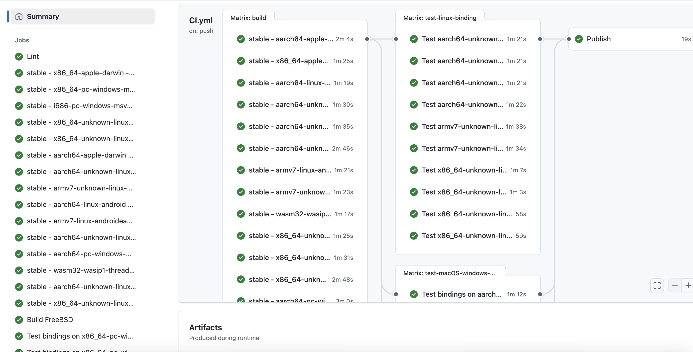

# Arkcode

<div class="flex items-center gap-2">
  
  
  
  
  
</div>

---
layout: center
---

# Visual Studio Code

---

# 为何要首当其冲，做 `vscode` 的适配？

<div grid="~ cols-2 gap-4" mt-10>
  <div v-click flex="~ col justify-center items-start" size-full rounded-xl bg="amber/40 dark:amber/20" block p="y-2 x-4">
    <div flex="~ items-center gap-2">
      <div class="i-ph-users-three-duotone text-size-8 text-black dark:text-amber" />
      <div>使用人数众多</div>
    </div>



  </div>

  <div flex="~ col gap-4">
    <div v-click flex="~ col justify-around items-start" size-full rounded-xl bg="red/40 dark:red/20" block p="y-2 x-4">
      <div flex="~ items-center gap-2">
        <div class="i-ph-robot-duotone text-size-8 text-black dark:text-red" />
        <div>AI 代码编辑器横行，类 vscode 编辑器繁多 </div>
      </div>
      <div mt-3 flex="~ items-center gap-2 wrap">
        
        
        <div class="i-vscode-icons-file-type-cursorrules text-size-7" />
        
      </div>
    </div>
    <div v-click flex="~ col justify-around items-start" size-full rounded-xl bg="blue/40 dark:blue/20" block p="y-2 x-4">
      <div flex="~ items-center gap-2">
        <div class="i-ph-plug-duotone text-size-8 text-black dark:text-coolGray" />
        <div>社区活跃，插件市场庞大</div>
      </div>
      <div mt-3 flex="~ items-center gap-2 wrap">
        <div class="i-vscode-icons-file-type-typescript-official text-size-7" />
        <div class="i-vscode-icons-file-type-html text-size-7" />
        <div class="i-vscode-icons-file-type-css text-size-7" />
        <div class="i-vscode-icons-file-type-cpp3 text-size-7" />
        <div class="i-vscode-icons-file-type-python text-size-7" />
        <div class="i-vscode-icons-file-type-go text-size-7" />
        <div class="i-vscode-icons-file-type-java text-size-7" />
        <div class="i-vscode-icons-file-type-kotlin text-size-7" />
        <div class="i-vscode-icons-file-type-flutter text-size-7" />
        <div class="i-vscode-icons-file-type-rust text-size-7" />
        <div class="i-vscode-icons-file-type-markdown text-size-7" />
        <div class="i-vscode-icons-file-type-ripple text-size-7" />
        <div class="i-vscode-icons-file-type-php text-size-7" />
        <div class="i-vscode-icons-file-type-zig text-size-7" />
        <div class="i-vscode-icons-file-type-swift text-size-7" />
        <div class="i-vscode-icons-file-type-vue text-size-7" />
        <div class="i-vscode-icons-file-type-svelte text-size-7" />
        <div class="i-vscode-icons-file-type-astro text-size-7" />
        <div class="i-vscode-icons-file-type-angular text-size-7" />
        <div class="i-vscode-icons-file-type-reactts text-size-7" />
        <div class="i-vscode-icons-file-type-bun text-size-7" />
        
      </div>
    </div>
  </div>
</div>

---
layoutClass: gap-4
---

# 现在适配遇到了哪些困难？

<v-clicks>

#### node.js 模块加载机制

```ts
// 加载 node.js 内置的 node:fs 文件系统模块
// require 函数是 node.js 内部提供给当前文件的，
// 它是符合 common.js 规范的函数。

const fs = require('node:fs')
```

```ts
// 如果文件系统中存在 foo.js 文件，则可以
// 直接通过 require 函数加载该文件
const myJavaScriptModule = require('./foo')
```

```typescript
// 如果文件系统中存在 bar.node 文件，则可以
// 直接通过 require 函数加载该文件
const myNodejsModule = require('./bar.node')
// 输出 native 侧的模块对象，供 JS 侧调用
console.log(myNodejsModule)
```

> `.node` 依赖类似 `.so`、`.dylib`、`.dll` 等动态链接库，它允许被 `node.js` 直接通过 require 函数加载

</v-clicks>


---

# 现在适配遇到了哪些困难？

#### 举个例子? `@arkts/project-detector` !

<v-clicks>

- `Rust` 编写，指定一个基础的工作目录，自动扫描检测该项目中包含的所有鸿蒙项目，同时是 `Naily's ArkTS Support` 插件的底层依赖之一；`项目 (Project)` - `模块 (Module)` - `产品 (Product)` - `资源文件夹 (Resource)` 多层级结构扫描和查询，精确到文件的 `Range` 范围
- 在该项目的 `CI/CD` 流程中，为了极大提高各种操作系统、架构的兼容性，编译了 `Windows`、`macOS`、`Linux`、`FreeBSD` 等平台的 `x86`、`arm64` 架构的 `.node` 依赖，并且都单独作为 `npm` 包发布到了 `npm` 仓库中，这得益于 `napi-rs` 库的强大支持，它同时也允许编译出 `ohos` 平台的 `.node` 依赖

</v-clicks>



---
layout: image-right
image: ./deveco-napi.png
---

# 现在适配遇到了哪些困难？

#### 在鸿蒙PC的 `Electron` APP 中

- 带有 `.node` 的JavaScript依赖需要根据 `CPU` 架构、指令集，放置在特殊的工程目录中(如 `libs/arm64-v8a` 目录)，才能被正确加载
- 符号表冲突，需要经过二次修改对应 `.node` 依赖的 `C/C++/Rust` 源码，再编译为 `.node` 才能被正确加载
- 如果 `vscode 插件` 中带有 `.node` 依赖，我们不知道该如何正确动态构建这些原生依赖，从而导致这些插件只要带了 `.node` 依赖，就无法正常工作

---
layout: end
---

# Thank you.
