---
layout: introduction
name: 古欢
avatar: ./images/avatar.png
tags:
  - ["i-carbon-location", "广东，梅州"]
  - ["i-carbon-education", "广州，大三"]
---

一个前端，参与过鸿蒙手表版 `腕上RSS` 的开发；

开发了一个 `ArkTS` vscode 插件，为 `vscode` 提供了 `ArkTS` 的语法高亮、代码补全、代码格式化等基础功能。

<div class="flex items-center gap-2">
  
  
  
  
  
</div>

---
layout: statement
---

# 从前端视角看鸿蒙PC开发

## 遇到的问题与实践

---
layout: image-right
image: ./post/about.png
backgroundSize: 85%
---

# 初体验

鸿蒙PC发布至今已过去6个多月

拿到的一瞬间真的很激动，它真的是太薄了，又薄又轻，比我现在用的 Macbook Air (M1) 还要薄要轻一半

无风扇设计，发热量并不大，而且非常的安静

整个系统特别的流畅丝滑 😊

---
layout: image-right
image: ./post/desktop-search.jpg
---

# 初体验

鸿蒙PC发布至今已过去6个多月

拿到的一瞬间真的很激动，它真的是太薄了，又薄又轻，比我现在用的 Macbook Air (M1) 还要薄要轻一半

无风扇设计，发热量并不大，而且非常的安静

整个系统特别的流畅丝滑 😊

整体风格上像是 **MacOS + Windows** 的结合体

- 整体非常流畅丝滑，动画效果很棒
- 没有多桌面功能，这个亟待完善
- 全局搜索是否有开放API给开发者使用？

---
layout: quote
---

# 应用生态

<!-- - 应用市场生态比较封闭式，和苹果一样
- 甚至在应用商店的审核机制上比苹果还要更加严格
- 应用市场的软件目前仍然还是以**国产C端软件**为主，面向开发者的D端软件比较少，质量也不高 -->

<SectionGrid>
  <SectionCard class="bg-red-500/50" v-click>
    应用市场生态比较封闭式，和苹果一样
  </SectionCard>
  <SectionCard class="bg-blue-500/50" v-click>
    甚至在应用商店的审核机制上比苹果还要更加严格
  </SectionCard>
  <SectionCard class="bg-green-500/50" v-click>
    应用市场的软件目前仍然还是以国产C端软件为主
  </SectionCard>
  <SectionCard class="bg-yellow-500/50" v-click>
    面向开发者的D端软件比较少，质量也不高
  </SectionCard>
</SectionGrid>

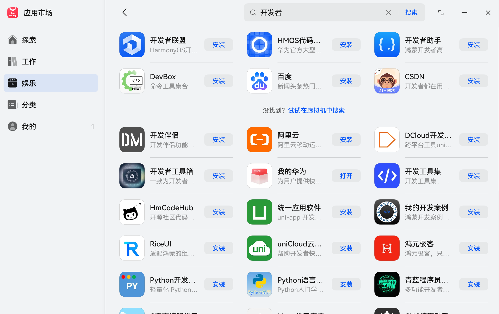

---

# DevEco Studio Next

传说中用 `Rust` 完全重写的 `DevEco Studio`

<v-clicks>

- 界面风格十分简洁, UI 参考 `DevEco Studio` Idea 版本
- **但是有很多地方有问题**

</v-clicks>

<div class="grid grid-cols-2 gap-4 mt-4">
  <div>
    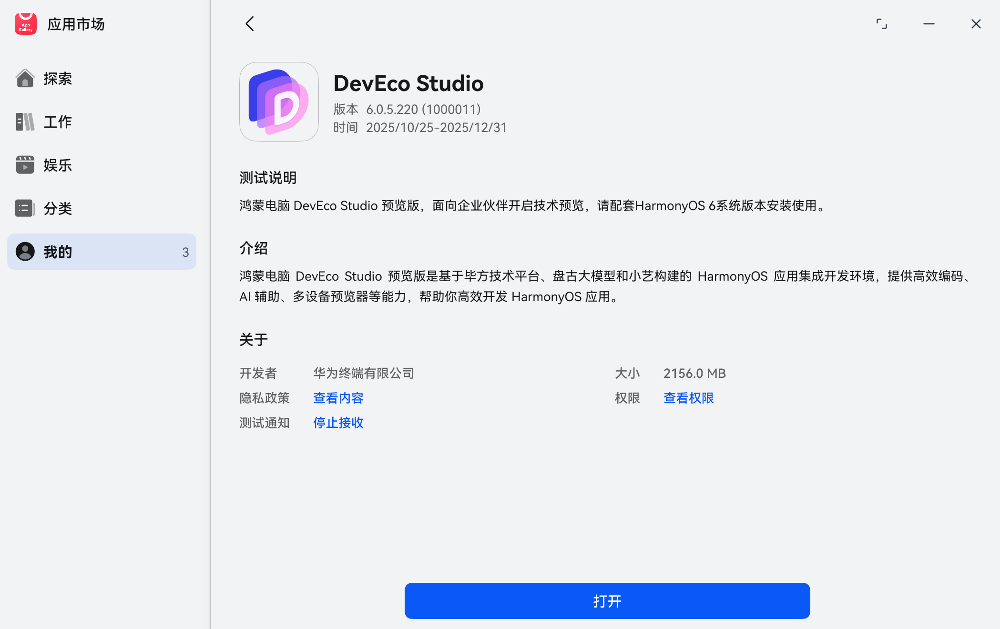
  </div>
  <div>
    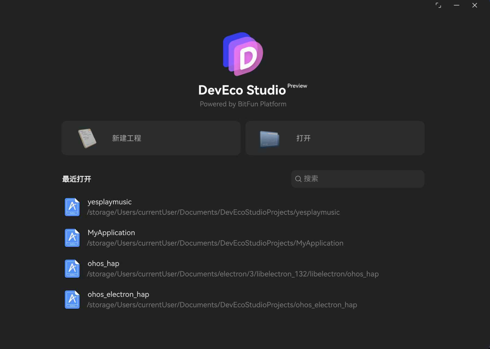
  </div>
</div>

---

# DevEco Studio Next 问题：不支持触屏

- 除了三键（最大化、最小化、关闭）按钮区域的标题栏可以拖动之外，其他区域都不支持触屏操作

<div class="mt-4">

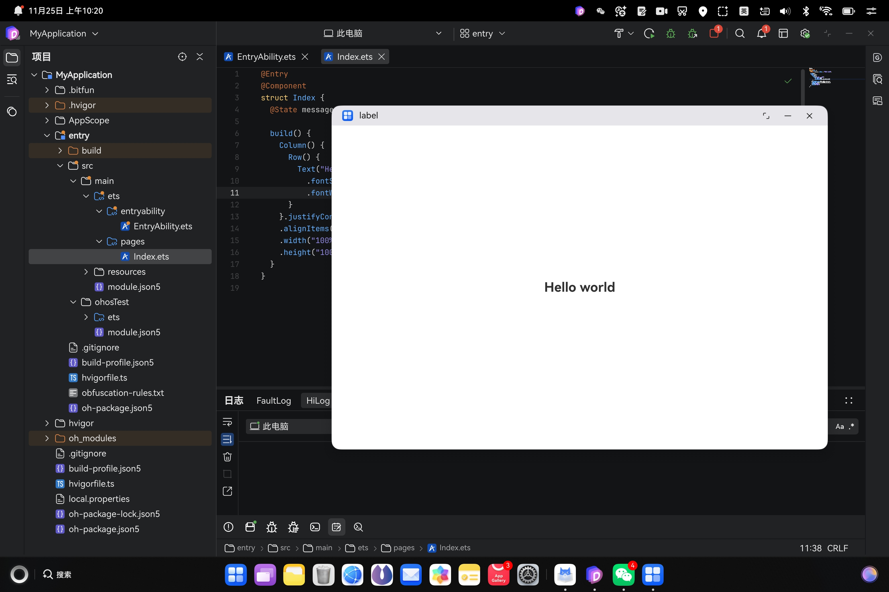

</div>

---

# DevEco Studio Next 问题：代码补全卡顿

- 代码补全的补全列表项多了之后，滚动会掉帧，非常卡顿

<video src="./videos/$r-slow.mp4" autoplay loop muted />

---

# DevEco Studio Next 问题：hilog无法显示日志

## 这是个巨大硬伤！没有日志没法调试=**无用啊**！{class="text-xl!"}

<video src="./videos/no-hilog.mp4" autoplay loop muted mt-4 />

---

# DevEco Studio Next 问题：跳转大文件卡死

- 有时候还会遇到整个APP卡死的问题
- 跳转到一个 OpenHarmony 内置的很大的 `.d.ts` 声明文件的时候，极其容易卡死
- 整个APP卡死点不动、鼠标除了三键之外点不了窗口内的任何东西
- 解决方法：设置里头强制关闭进程

😮‍💨 现在看来这个 `DevEco Studio Next` 仍然有各种各样的问题，特别是前面提到的几个硬伤，导致这个新IDE其实根本没法正常用，还是任重道远

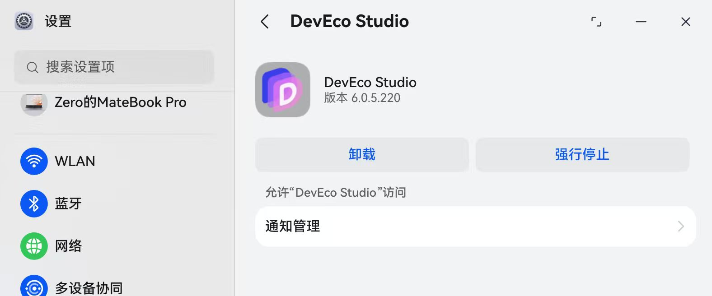

---
layout: full
---

<video src="./videos/reference-bug.mp4" controls size-full />

---
layout: quote
---

# DevEco Studio Next 的内置工具

`git`、`node`、`npm`这些，在 `DevEco Studio Next` 的内置终端里是有自带在里面的

但是，他不和外部的 `git` 互通！比如和 `git next` 的 `git` 是不互通的，这就导致要配置多次 Git SSH 密钥，特别麻烦

<div class="mt-4 flex justify-center gap-4">

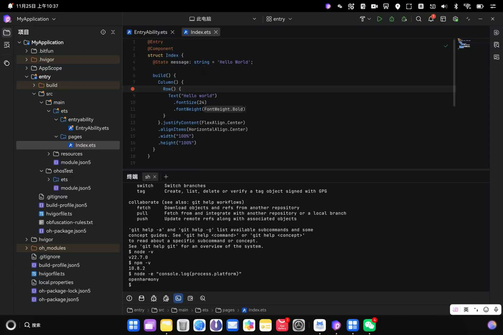

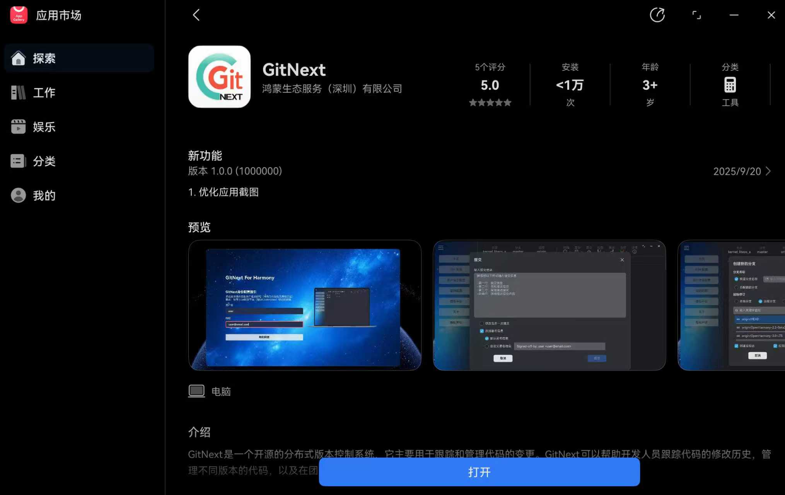

</div>

---
layout: quote
---

# DevEco Studio Next 的内置工具

`git`、`node`、`npm`这些，在 `DevEco Studio Next` 的内置终端里是有自带在里面的

但是，他不和外部的 `git` 互通！比如和 `git next` 的 `git` 是不互通的，这就导致要配置多次 Git SSH 密钥，特别麻烦

<div class="mt-4 flex justify-center gap-4">

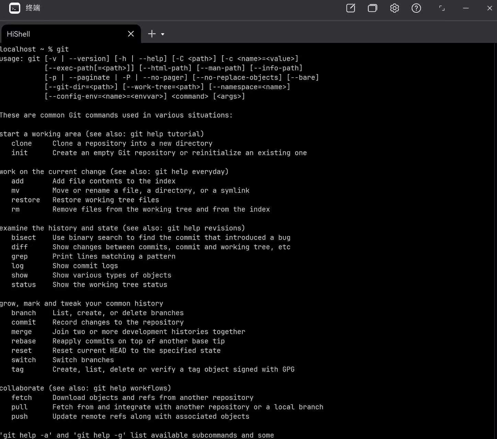

</div>
---
layout: statement
---

# 任重道远

---
layout: quote
---

# .hnp 包限制

全称： `HarmonyOS Native Package`

- 每个像 `git`、`node`、`npm` 这些工具都需要打包成 **`.hnp`** 格式的包

- 编译之后还必须放在鸿蒙 `hvigor` 工程的 `hnp` 目录下

- `.hap` 应用本身不能直接动态通过API（比如 `ArkTS API`，`C/C++ API`）去动态管理和加载 `hnp` 包，只能固定在项目工程的指定目录添加

- 不人性化 希望能有更好的管理 `.hnp` 包的方式，比如增加一个 `hnp` 包管理器，提供应用内管理 `hnp` 包的能力

- 社区已经 Fork 了 `homebrew` 但是处于新建文件夹阶段

---

# Electron 适配: vscode

我们想为鸿蒙PC做一下 `vscode` 的鸿蒙PC适配

在此之前我们看了一下鸿蒙PC上已经有的一个 `vscode 的 fork`：**CodeArts**

缺少一个很重要的功能： **`vscode插件市场`**

有朝一日能接入，建议接入 `open-vsx`, 它属于 Eclipse 基金会，有社区支持，规避微软的问题

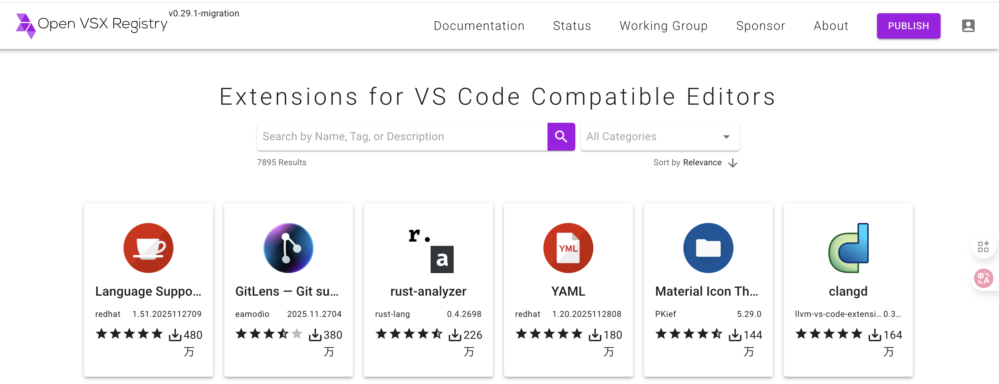

---

# Electron 适配: vscode

我们想为鸿蒙PC做一下 `vscode` 的鸿蒙PC适配

在此之前我们看了一下鸿蒙PC上已经有的一个 `vscode 的 fork`：**CodeArts**

缺少一个很重要的功能： **`vscode插件市场`**

`Cursor`、`Trae` 等海量AI编辑器都接入了 `open-vsx` 插件市场


---

# Electron 适配: vscode

我们想为鸿蒙PC做一下 `vscode` 的鸿蒙PC适配

在此之前我们看了一下鸿蒙PC上已经有的一个 `vscode 的 fork`：**CodeArts**

缺少一个很重要的功能： **`vscode插件市场`**

## 为什么把插件市场给阉割了？{class="mb-3"}

<v-click>

- 鸿蒙PC里面，`electron` 的 **`.node` 依赖加载问题**
</v-click>


---
layout: quote
transition: slide-up
---

# .node 文件

<div class="flex justify-center items-center gap-6">

<div>

`.node` 文件相当于是 `Node.js` 中的动态链接库文件

又或是你可以称之为 `node.js addon` (Node.js 扩展)

你可以在 `C` / `C++` / `Rust` 中利用 node.js 的 `napi` 来编写 node.js 的扩展

</div>

<div>

```js
// 在 Node.js 中加载 .node 文件
// require 是 Node.js 的模块系统中用来加载模块的函数
// addon 是一个对象，它包含了 .node 文件导出的所有js方法和属性
const addon = require('path/to/addon.node')
```

> 类似 Windows 的 `.dll` 文件，MacOS 的 `.dylib` 文件，Linux 的 `.so` 文件

</div>
</div>

---
layout: quote
---

# .node 编译问题

按照常规思维，我们需要把 `electron APP` 里面所有依赖了 `.node` 动态链接库的 npm 包都 `Fork` 出来

编译为鸿蒙PC的 `arm64-unknown-linux-ohos` 架构就可以了

但是，鸿蒙的 `electron` 环境下不知道为什么，和普通的 `napi` 好像不太一样

编译出来还不行，运行之后会提示 **`symbol not found`** 即，找不到符号的错误

最后还是 `@三川` 通过一个 `shim` 垫片仓库 [electron-ohos-napi-shim](https://gitcode.com/ohosvscode/electron-ohos-napi-shim) 解决了 node.js 中的 `sqlite` 的 `.node` 加载的问题

---
layout: statement
---

# .node 编译问题: 解决方案

立足于当下的情况，我们有如下解决方案{class="mb-5! mt-5!"}

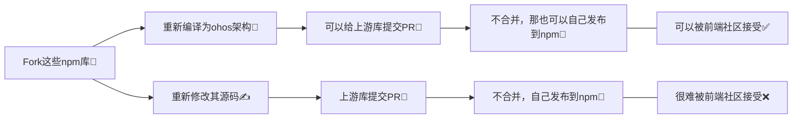
```mermaid
flowchart LR
  A["Fork这些npm库🧧"] --> B["重新编译为ohos架构🔧"]
  B --> C["可以给上游库提交PR💖"]
  C --> D["不合并，那也可以自己发布到npm🚀"]
  D --- E["可以被前端社区接受✅"]
  A --> F["重新修改其源码✍️"]
  F --> G["上游库提交PR🥹"]
  G --> H["不合并，自己发布到npm🚀"]
  H --- I["很难被前端社区接受❌"]
```

<div v-click class="mt-10!">


```mermaid
flowchart LR
  A["让鸿蒙PC直接兼容.node文件？🤔"]
  A --- B["编译为arm64-unknown-linux-musl架构就可以正常加载🔧"]
  B --> C["只需要修改package.json下载原生依赖的策略即可，让鸿蒙PC直接作为linux平台下载依赖🚀"]
  C --> D["皆大欢喜🎉"]
```

</div>

---
layout: quote
---

# .node 编译问题

- 但是，这个目前只是仅仅解决了 `sqlite` 的 `.node` 加载的问题
- 其他还有很多 `.node` 文件加载的问题他也没有解决
- 如果每个原生的 `.node` 都要去 `Fork` 出来修改，那这个工作量就太大了，而且也不现实
- 能不能让 `electron` 的 `.node` 能直接在鸿蒙PC上原生加载？

````md magic-move
```js
/**
 * node-sqlite3 是一个 sqlite 数据库连接查询库
 *
 * 它的底层是使用 C/CPP 编写的。
 */
const sqlite = require('./node-sqlite3.node')
```
```js
/**
 * libsql 是一个 mysql 数据库连接查询库
 *
 * 它的底层也是使用 Rust 编写的。
 */
const mysql = require('./libsql.node')
```
```js
/**
 * @vscode/spdlog 是一个跨平台日志库
 *
 * 它的底层是使用 C/CPP 编写的，被用于 vscode 的日志系统中。
 */
const spdlog = require('./vscode-spdlog.node')
```
```js
/**
 * Arkcode组织内维护的 `@arkts/project-detector` 项目，
 *
 * 指定一个文件夹，然后它会自动扫描该文件夹下所有的鸿蒙（hvigor）工程，并且从：
 *
 * - Project（工程）
 * - Module（模块）
 * - Product（产品）
 * - Resource（资源）
 *
 * 等多层次识别，并且渐进式监听文件变化；
 * 它被用于我写的 ArkTS vscode 插件中，给 module.json5 和 ArkTS 文件等进行高性能的代码补全。
 * 同时，它的底层是基于 `Rust` 编写的。
 */
const projectDetector = require('./project-detector.node')
```
````

---

# .node 存放位置问题

目前带有 `.node` 依赖的 `npm` 包是只能存放在工程目录的 `libs/arm64-v8a/node_modules` 下的

这样加载，限制性很大

如果我需要动态从网络上下载 `.node` 文件然后加载，那该怎么办？**无解了**

<div class="mt-4">

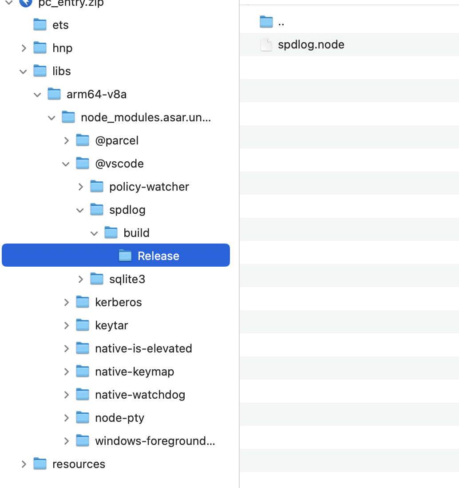

</div>

---

# 目前的成果

我们已经将 **YesPlayMusic** 这个网易云第三方客户端移植到了鸿蒙PC上

因为它是几乎没有带 `.node` 依赖的（有一个，很容易去除，不是核心功能），纯 `JavaScript` 代码开发的项目

现在已经可以正常移植到鸿蒙PC运行了

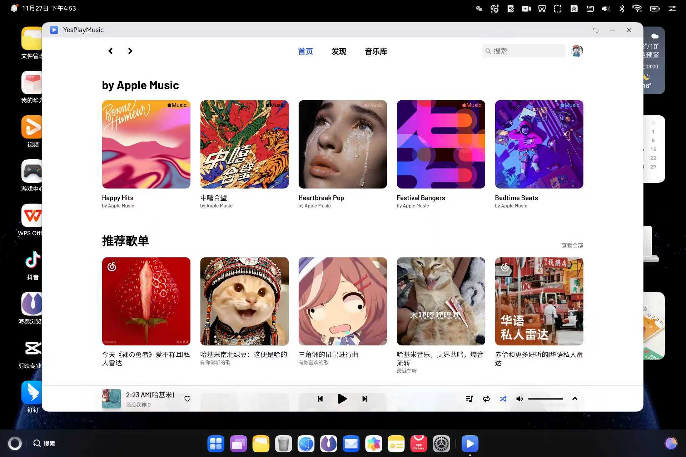

---

# 性能问题

但是仍然存在一个问题

不知道为什么我感觉这个 `YesPlayMusic` 帧率明显低于原生的鸿蒙APP

现在帧率目测的话，只有**20-30帧**左右（可能都不到），感觉滚动起来很卡顿

<video src="./videos/yesplaymusic.mp4" autoplay loop muted mt-4 />

---

# 关于 `process.platform` 的不一致

`process` 是 node.js 中的一个全局对象，它代表当前的 `node.js` 进程

常常用于获取当前进程的环境信息，比如环境变量、平台信息都存放在 `process` 对象中

我们可以通过 `process.platform` 来获取当前进程的平台信息

````md magic-move
```bash
# 在 node.js 中打印 process.platform 的平台信息
node -e "console.log(process.platform)"
```
```bash
# 在 CodeArts、DevEco Studio Preview 中打印，
# 将会输出 `openharmony`
node -e "console.log(process.platform)" # 'openharmony'
```
````

<v-click>

```js
// 在 Electron APP 中打印
// 将会输出 `ohos`
console.log(process.platform) // 'ohos'
```

</v-click>

<v-click>

为什么 `electron` 的 `process.platform` 的值和鸿蒙PC的不一样呢？

到底哪个值是正确的呢？

</v-click>

<v-click>

另外，我们能否在编译 node.js 的时候修改该值？

</v-click>

<v-click>

该值在 js 中是无法被修改的，这样我们适配起 electron APP 时，就可以先将其改为 `linux` 以快速适配现有 electron APP

</v-click>

---

# 总结

<SectionGrid>
  <SectionCard class="bg-red-500/50 h-full min-h-50">
    鸿蒙PC硬件优秀，基础系统流畅，C端生态完善
  </SectionCard>
  <SectionCard class="bg-blue-500/50 h-full min-h-50 flex flex-col gap-2">
    <div>DevEco Studio Next 仍处于早期阶段</div>
    <ul>
      <li>不支持触屏</li>
      <li>hilog日志面板无法显示当前APP的日志</li>
      <li>整个APP卡死问题</li>
      <li>跳转大文件卡死问题</li>
    </ul>
  </SectionCard>
  <SectionCard class="bg-green-500/50 h-full min-h-50 flex flex-col gap-2">
    Electron 适配面临各种挑战
    <ul>
      <li>原生生态兼容性问题 <code>.node</code> 文件加载问题</li>
      <li>性能问题</li>
      <li>平台标识符不一致问题</li>
    </ul>
  </SectionCard>
  <SectionCard class="bg-yellow-500/50 h-full min-h-50 flex flex-col gap-2">
    <div>CodeArts/vscode 和生态开发工具适配问题</div>
    <ul>
      <li>插件市场阉割</li>
      <li>CodeArts本身不开源</li>
      <li>Electron APP 在鸿蒙PC上的各种问题</li>
    </ul>
  </SectionCard>
</SectionGrid>

---
layout: statement
---

# Thanks you{class="mb-10!"}

2025年11月
